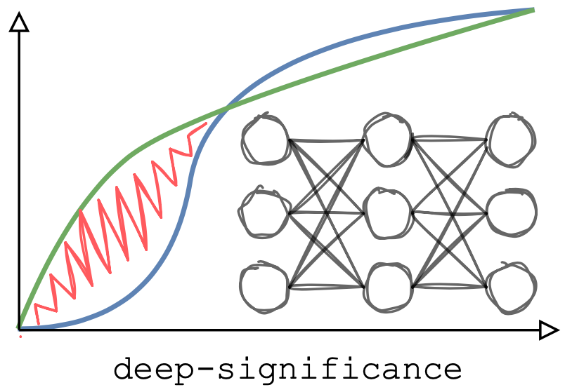

# deep-significance: Easy and Better Significance Testing for Deep Neural Networks

[]()
[](https://coveralls.io/github/Kaleidophon/deep-significance?branch=main)
[]()
[](https://www.gnu.org/licenses/gpl-3.0)
[](https://github.com/python/black)
[](https://zenodo.org/badge/latestdoi/341677886)



**Contents**

* [:interrobang: Why](#interrobang-why)
* [:inbox_tray: Installation](#inbox_tray-installation)
* [:bookmark: Examples](#bookmark-examples)
  * [Intermezzo: Almost Stochastic Order - a better significance test for Deep Neural Networks](#intermezzo-almost-stochastic-order---a-better-significance-test-for-deep-neural-networks)
  * [Scenario 1: Comparing multiple runs of two models](#scenario-1---comparing-multiple-runs-of-two-models)
  * [Scenario 2: Comparing multiple runs across datasets](#scenario-2---comparing-multiple-runs-across-datasets) 
  * [Scenario 3: Comparing sample-level scores](#scenario-3---comparing-sample-level-scores)
  * [Scenario 4: Comparing more than two models](#scenario-4---comparing-more-than-two-models)
  * [How to report results](#newspaper-how-to-report-results)
  * [Sample size](#control_knobs-sample-size)
  * [Other features](#sparkles-other-features)
  * [General Recommendations & other notes](#general-recommendations) 
* [:mortar_board: Cite](#mortar_board-cite)
* [:medal_sports: Acknowledgements](#medal_sports-acknowledgements)
* [:people_holding_hands: Papers using deep-significance](#people_holding_hands-papers-using-deep-significance)
* [:books: Bibliography](#books-bibliography)

### :interrobang: Why?

Although Deep Learning has undergone spectacular growth in the recent decade,
a large portion of experimental evidence is not supported by statistical hypothesis tests. Instead, 
conclusions are often drawn based on single performance scores. 

This is problematic: Neural network display highly non-convex
loss surfaces (Li et al., 2018) and their performance depends on the specific hyperparameters that were found, or stochastic factors 
like Dropout masks, making comparisons between architectures more difficult. Based on comparing only (the mean of) a 
few scores, **we often cannot 
conclude that one model type or algorithm is better than another**.
This endangers the progress in the field, as seeming success due to random chance might lead practitioners astray. 

For instance, a recent study in Natural Language Processing by Narang et al. (2021) has found that many modifications proposed to 
transformers do not actually improve performance. Similar issues are known to plague other fields like e.g., 
Reinforcement Learning (Henderson et al., 2018) and Computer Vision (Borji, 2017) as well. 

To help mitigate this problem, this package supplies fully-tested re-implementations of useful functions for significance
testing:
* Statistical Significance tests such as Almost Stochastic Order (del Barrio et al, 2017; Dror et al., 2019), 
  bootstrap (Efron & Tibshirani, 1994) and permutation-randomization (Noreen, 1989).
* Bonferroni correction methods for multiplicity in datasets (Bonferroni, 1936). 
* Bootstrap power analysis (Yuan & Hayashi, 2003) and other functions to determine the right sample size.

All functions are fully tested and also compatible with common deep learning data structures, such as PyTorch / 
Tensorflow tensors as well as NumPy and Jax arrays.  For examples about the usage, consult the documentation 
[here](https://deep-significance.readthedocs.io/en/latest/) , the scenarios in the section [Examples](#examples) or 
the [demo Jupyter notebook](https://github.com/Kaleidophon/deep-significance/tree/main/paper/deep-significance%20demo.ipynb).

## :inbox_tray: Installation

The package can simply be installed using `pip` by running

    pip3 install deepsig

Another option is to clone the repository and install the package locally:

    git clone https://github.com/Kaleidophon/deep-significance.git
    cd deep-significance
    pip3 install -e .

**Warning**: Installed like this, imports will fail when the clones repository is moved.

## :bookmark: Examples

---
**tl;dr**: Use `aso()` to compare scores for two models. If the returned `eps_min < 0.5`, A is better than B. The lower
`eps_min`, the more confident the result (we recommend to check `eps_min < 0.2` and record `eps_min` alongside 
experimental results). 

:warning: Testing models with only one set of hyperparameters and only one test set will be able to guarantee superiority
in all settings. See [General Recommendations & other notes](#general-recommendations).

---

In the following, we will lay out three scenarios that describe common use cases for ML practitioners and how to apply 
the methods implemented in this package accordingly. For an introduction into statistical hypothesis testing, please
refer to resources such as [this blog post](https://machinelearningmastery.com/statistical-hypothesis-tests/) for a general
overview or [Dror et al. (2018)](https://www.aclweb.org/anthology/P18-1128.pdf) for a NLP-specific point of view. 

We assume that we have two sets of scores we would like to compare,  and ,
for instance obtained by running two models  and  multiple times with a different random seed. 
We can then define a one-sided test statistic   based on the gathered observations. 
An example of such test statistics is for instance the difference in observation means. We then formulate the following null-hypothesis:

<p align="center"></p>

That means that we actually assume the opposite of our desired case, namely that  is not better than , 
but equally as good or worse, as indicated by the value of the test statistic. 
Usually, the goal becomes to reject this null hypothesis using the SST. 
*p*-value testing is a frequentist method in the realm of SST. 
It introduces the notion of data that *could have been observed* if we were to repeat our experiment again using 
the same conditions, which we will write with superscript  in order to distinguish them from our actually 
observed scores (Gelman et al., 2021). 
We then define the *p*-value as the probability that, under the null hypothesis, the test statistic using replicated 
observation is larger than or equal to the *observed* test statistic:

<p align="center"></p>

We can interpret this expression as follows: Assuming that  is not better than , the test 
assumes a corresponding distribution of statistics that  is drawn from. So how does the observed test statistic 
 fit in here? This is what the -value expresses: When the 
probability is high,  is in line with what we expected under the 
null hypothesis, so we can *not* reject the null hypothesis, or in other words, we \emph{cannot} conclude 
 to be better than . If the probability is low, that means that the observed 
 is quite unlikely under the null hypothesis and that the reverse case is 
more likely - i.e. that it is likely larger than - and we conclude that  is indeed better than 
. Note that **the -value does not express whether the null hypothesis is true**. To make our decision 
about whether or not to reject the null hypothesis, we typically determine a threshold - the significance level 
, often set to 0.05 - that the *p*-value has to fall below. However, it has been argued that a better practice 
involves reporting the *p*-value alongside the results without a pidgeonholing of results into significant and non-significant
(Wasserstein et al., 2019).


### Intermezzo: Almost Stochastic Order - a better significance test for Deep Neural Networks

Deep neural networks are highly non-linear models, having their performance highly dependent on hyperparameters, random 
seeds and other (stochastic) factors. Therefore, comparing the means of two models across several runs might not be 
enough to decide if a model A is better than B. In fact, **even aggregating more statistics like standard deviation, minimum
or maximum might not be enough** to make a decision. For this reason, del Barrio et al. (2017) and Dror et al. (2019) 
introduced *Almost Stochastic Order* (ASO), a test to compare two score distributions. 

It builds on the concept of *stochastic order*: We can compare two distributions and declare one as *stochastically dominant*
by comparing their cumulative distribution functions: 


Here, the CDF of A is given in red and in green for B. If the CDF of A is lower than B for every , we know the 
algorithm A to score higher. However, in practice these cases are rarely so clear-cut (imagine e.g. two normal 
distributions with the same mean but different variances).
For this reason, del Barrio et al. (2017) and Dror et al. (2019) consider the notion of *almost stochastic dominance* 
by quantifying the extent to which stochastic order is being violated (red area):


ASO returns a value , which expresses (an upper bound to) the amount of violation of stochastic order. If 
 (where \tau is 0.5 or less), A is stochastically dominant over B in more cases than vice versa, then the corresponding algorithm can be declared as 
superior. We can also interpret  as a *confidence score*. The lower it is, the more sure we can be 
that A is better than B. Note: **ASO does not compute p-values.** Instead, the null hypothesis formulated as 

<p align="center"></p>

If we want to be more confident about the result of ASO, we can also set the rejection threshold to be lower than 0.5 
(see the discussion in [this section](#general-recommendations)).
Furthermore, the significance level  is determined as an input argument when running ASO and actively influence 
the resulting .


### Scenario 1 - Comparing multiple runs of two models 

In the simplest scenario, we have retrieved a set of scores from a model A and a baseline B on a dataset, stemming from 
various model runs with different seeds. We want to test whether our model A is better than B (higher scores = better)- 
We can now simply apply the ASO test:

```python
import numpy as np
from deepsig import aso

seed = 1234
np.random.seed(seed)

# Simulate scores
N = 5  # Number of random seeds
my_model_scores = np.random.normal(loc=0.9, scale=0.8, size=N)
baseline_scores = np.random.normal(loc=0, scale=1, size=N)

min_eps = aso(my_model_scores, baseline_scores, seed=seed)  # min_eps = 0.225, so A is better
```

Note that ASO **does not make any assumptions about the distributions of the scores**. 
This means that we can apply it to any kind of test metric, as long as a higher score indicates a better performance 
(to apply ASO to cases where lower scores indicate better performances, just multiple your scores by -1 before feeding
them into the function). The more scores of model runs is supplied, the more reliable 
the test becomes, so try to collect scores from as many runs as possible to reject the null hypothesis confidently.

### Scenario 2 - Comparing multiple runs across datasets

When comparing models across datasets, we formulate one null hypothesis per dataset. However, we have to make sure not to 
fall prey to the [multiple comparisons problem](https://en.wikipedia.org/wiki/Multiple_comparisons_problem): In short, 
the more comparisons between A and B we are conducting, the more likely gets is to reject a null-hypothesis accidentally.
That is why we have to adjust our significance threshold  accordingly by dividing it by the number of comparisons, 
which corresponds to the Bonferroni correction (Bonferroni et al., 1936):

```python 
import numpy as np
from deepsig import aso 

seed = 1234
np.random.seed(seed)

# Simulate scores for three datasets
M = 3  # Number of datasets
N = 5  # Number of random seeds
my_model_scores_per_dataset = [np.random.normal(loc=0.3, scale=0.8, size=N) for _ in range(M)]
baseline_scores_per_dataset  = [np.random.normal(loc=0, scale=1, size=N) for _ in range(M)]

# epsilon_min values with Bonferroni correction 
eps_min = [aso(a, b, confidence_level=0.95, num_comparisons=M, seed=seed) for a, b in zip(my_model_scores_per_dataset, baseline_scores_per_dataset)]
# eps_min = [0.006370113450148568, 0.6534772728574852, 0.0]
```

### Scenario 3 - Comparing sample-level scores

In previous examples, we have assumed that we compare two algorithms A and B based on their performance per run, i.e. 
we run each algorithm once per random seed and obtain exactly one score on our test set. In some cases however, 
we would like to compare two algorithms based on scores **for every point in the test set**. If we only use one seed
per model, then this case is equivalent to scenario 1. But what if we also want to use multiple seeds per model?

In this scenario, we can do pair-wise comparisons of the score distributions between A and B and use the Bonferroni 
correction accordingly:

```python 
from itertools import product 

import numpy as np
from deepsig import aso 

seed = 1234
np.random.seed(seed)

# Simulate scores for three datasets
M = 40   # Number of data points
N = 3  # Number of random seeds
my_model_scored_samples_per_run = [np.random.normal(loc=0.3, scale=0.8, size=M) for _ in range(N)]
baseline_scored_samples_per_run = [np.random.normal(loc=0, scale=1, size=M) for _ in range(N)]
pairs = list(product(my_model_scored_samples_per_run, baseline_scored_samples_per_run))

# epsilon_min values with Bonferroni correction 
eps_min = [aso(a, b, confidence_level=0.95, num_comparisons=len(pairs), seed=seed) for a, b in pairs]
# eps_min = [0.3831678636198528, 0.07194780234194881, 0.9152792807128325, 0.5273463008857844, 0.14946944524461184, 1.0, 
# 0.6099543280369378, 0.22387448804041898, 1.0]
```

### Scenario 4 - Comparing more than two models 

Similarly, when comparing multiple models (now again on a per-seed basis), we can use a similar approach like in the 
previous example. For instance, for three models, we can create a  matrix and fill the entries 
with the corresponding  values.

The package implements the function `multi_aso()` exactly for this purpose. It has the same arguments as `aso()`, with 
a few differences. First of all, the function takes a single `scores` argument, which can be a list of lists (of scores),
or a nested NumPy array or Tensorflow / PyTorch / Jax tensor or dictionary (more about that later). 
Let's look at an example:

```python 
import numpy as np 
from deepsig import multi_aso 

seed = 1234
np.random.seed(seed)
 
N = 5  # Number of random seeds
M = 3  # Number of different models / algorithms

# Simulate different model scores by sampling from normal distributions with increasing means
# Here, we will sample from N(0.1, 0.8), N(0.15, 0.8), N(0.2, 0.8)
my_models_scores = np.array([np.random.normal(loc=loc, scale=0.8, size=N) for loc in np.arange(0.1, 0.1 + 0.05 * M, step=0.05)])

eps_min = multi_aso(my_models_scores, confidence_level=0.95, seed=seed)
    
# eps_min =
# array([[1.       , 0.92621655, 1.        ],
#       [1.        , 1.        , 1.        ],
#       [0.82081635, 0.73048716, 1.        ]])
```

In the example, `eps_min` is now a matrix, containing the  score between all pairs of models (for 
the same model, it set to 1 by default). The matrix is always to be read as ASO(row, column).

The function applies the bonferroni correction for multiple comparisons by 
default, but this can be turned off by using `use_bonferroni=False`.

Lastly, when the `scores` argument is a dictionary and the function is called with `return_df=True`, the resulting matrix is 
given as a `pandas.DataFrame` for increased readability:

```python 
import numpy as np 
from deepsig import multi_aso 

seed = 1234
np.random.seed(seed)
 
N = 5  # Number of random seeds
M = 3  # Number of different models / algorithms

# Same setup as above, but use a dict for scores
my_models_scores = {
  f"model {i+1}": np.random.normal(loc=loc, scale=0.8, size=N) 
  for i, loc in enumerate(np.arange(0.1, 0.1 + 0.05 * M, step=0.05))
}

# my_model_scores = {
#   "model 1": array([...]),
#   "model 2": array([...]),
#   ...
# }

eps_min = multi_aso(my_models_scores, confidence_level=0.95, return_df=True, seed=seed)
    
# This is now a DataFrame!
# eps_min =
#          model 1   model 2  model 3
# model 1  1.000000  0.926217      1.0
# model 2  1.000000  1.000000      1.0
# model 3  0.820816  0.730487      1.0

```

### :newspaper: How to report results

When ASO used, two important details have to be reported, namely the confidence level  and the 
score. Below lists some example snippets reporting the results of scenarios 1 and 4:

    Using ASO with a confidence level $\alpha = 0.05$, we found the score distribution of algorithm A based on three 
    random seeds to be stochastically dominant over B ($\epsilon_\text{min} = 0$).

    We compared all pairs of models based on five random seeds each using ASO with a confidence level of 
    $\alpha = 0.05$ (before adjusting for all pair-wise comparisons using the Bonferroni correction). Almost stochastic 
    dominance ($\epsilon_\text{min} < \tau$ with $\tau = 0.2$) is indicated in table X.

### :control_knobs: Sample size

It can be hard to determine whether the currently collected set of scores is large enough to allow for reliable 
significance testing or whether more scores are required. For this reason, `deep-significance` also implements functions to aid the decision of whether to 
collect more samples or not. 

First of all, it contains *Bootstrap power analysis* (Yuan & Hayashi, 2003): Given a set of scores, it gives all of them a uniform lift to 
create an artificial, second sample. Then, the analysis runs repeated analyses using bootstrapped versions of both 
samples, comparing them with a significance test. Ideally, this should yield a significant result: If the difference 
between the re-sampled original and the lifted sample is non-significant, the original sample has too high of a variance. The 
analyses then returns the *percentage of comparisons* that yielded significant results. If the number is too low, 
more scores should be collected and added to the sample. 

The result of the analysis is the *statistical power*: The 
higher the power, the smaller the risk of falling prey to a Type II error - the probability of mistakenly accepting the 
null hypothesis, when in fact it should actually be rejected. Usually, a power of ~ 0.8 is recommended (although that is
sometimes hard to achieve in a machine learning setup).

The function can be used in the following way:

```python
import numpy as np
from deepsig import bootstrap_power_analysis

scores = np.random.normal(loc=0, scale=20, size=5)  # Create too small of a sample with high variance
power = bootstrap_power_analysis(scores, show_progress=False)  # 0.081, way too low

scores2 = np.random.normal(loc=0, scale=20, size=50)  # Let's collect more samples
power2 = bootstrap_power_analysis(scores2, show_progress=False)  # Better power with 0.2556
```

By default, `bootstrap_power_analysis()` uses a one-sided Welch's t-test. However, this can be modified by passing 
a function to the `significance_test` argument, which expects a function taking two sets of scores and returning a 
p-value.

Secondly, if the Almost Stochastic Order test (ASO) is being used, there is a second function available. ASO estimates
the violation ratio of two samples using bootstrapping. However, there is necessarily some uncertainty around that 
estimate, given that we only possess a finite number of samples. Using more samples decreases the uncertainty and makes the estimate tighter.
The degree to which collecting more samples increases the tightness can be computed using the following function:

```python
import numpy as np
from deepsig import aso_uncertainty_reduction

scores1 = np.random.normal(loc=0, scale=0.3, size=5)  # First sample with five scores
scores2 = np.random.normal(loc=0.2, scale=5, size=3)  # Second sample with three scores

red1 = aso_uncertainty_reduction(m_old=len(scores1), n_old=len(scores2), m_new=5, n_new=5)  # 1.1547005383792515
red2 = aso_uncertainty_reduction(m_old=len(scores1), n_old=len(scores2), m_new=7, n_new=3)  # 1.0583005244258363

# Adding two runs to scores1 increases tightness of estimate by 1.15
# But adding two runs to scores2 only increases tightness by 1.06! So spending two more runs on scores1 is better
```

### :sparkles: Other features

#### :rocket: For the impatient: ASO with multi-threading

Waiting for all the bootstrap iterations to finish can feel tedious, especially when doing many comparisons. Therefore, 
ASO supports multithreading using `joblib`
via the `num_jobs` argument. 

```python
from deepsig import aso
import numpy as np
from timeit import timeit

a = np.random.normal(size=1000)
b = np.random.normal(size=1000)

print(timeit(lambda: aso(a, b, num_jobs=1, show_progress=False), number=5))  # 616.2249192680001
print(timeit(lambda: aso(a, b, num_jobs=4, show_progress=False), number=5))  # 208.05637107000007
```

If you want to select the maximum number of jobs possible on your device, you can set `num_jobs=-1`:

```pythons
print(timeit(lambda: aso(a, b, num_jobs=-1, show_progress=False), number=5))  # 187.26257274800003
```

#### :electric_plug: Compatibility with PyTorch, Tensorflow, Jax & Numpy

All tests implemented in this package also can take PyTorch / Tensorflow tensors and Jax or NumPy arrays as arguments:

```python
from deepsig import aso 
import torch

a = torch.randn(5, 1)
b = torch.randn(5, 1)

aso(a, b)  # It just works!
```

#### :woman_farmer: Setting seeds for replicability

In order to ensure replicability, both `aso()` and `multi_aso()` supply as `seed` argument. This even works 
when multiple jobs are used!

#### :game_die: Permutation and bootstrap test 

Should you be suspicious of ASO and want to revert to the good old faithful tests, this package also implements 
the paired-bootstrap as well as the permutation randomization test. Note that as discussed in the next section, these 
tests have less statistical power than ASO. Furthermore, a function for the Bonferroni-correction using 
p-values can also be found using `from deepsig import bonferroni_correction`.

```python3
import numpy as np
from deepsig import bootstrap_test, permutation_test

a = np.random.normal(loc=0.8, size=10)
b = np.random.normal(size=10)

print(permutation_test(a, b))  # 0.16183816183816183
print(bootstrap_test(a, b))    # 0.103
```


### General recommendations & other notes

* Naturally, the CDFs built from `scores_a` and `scores_b` can only be approximations of the true distributions. Therefore,
as many scores as possible should be collected, especially if the variance between runs is high. If only one run is available,
  comparing sample-wise score distributions like in scenario 3 can be an option, but comparing multiple runs will 
  **always** be preferable. Ideally, scores should be obtained even using different sets of hyperparameters per model.
  Because this is usually infeasible in practice, Bouthilier et al. (2020) recommend to **vary all other sources of variation**
  between runs to obtain the most trustworthy estimate of the "true" performance, such as data shuffling, weight initialization etc.

* `num_bootstrap_iterations` can be reduced to increase the speed of `aso()`. However, this is not 
recommended as the result of the test will also become less accurate. Technically,  is a upper bound
  that becomes tighter with the number of samples and bootstrap iterations (del Barrio et al., 2017). Thus, increasing 
  the number of jobs with `num_jobs` instead is always preferred.
  
* While we could declare a model stochastically dominant with , we found this to have a comparatively high
Type I error (false positives). Tests [in our paper](https://arxiv.org/pdf/2204.06815.pdf) have shown that a more useful threshold that trades of Type I and 
  Type II error between different scenarios might be .
  
* Bootstrap and permutation-randomization are all non-parametric tests, i.e. they don't make any assumptions about 
the distribution of our test metric. Nevertheless, they differ in their *statistical power*, which is defined as the probability
  that the null hypothesis is being rejected given that there is a difference between A and B. In other words, the more powerful 
  a test, the less conservative it is and the more it is able to pick up on smaller difference between A and B. Therefore, 
  if the distribution is known or found out why normality tests (like e.g. Anderson-Darling or Shapiro-Wilk), something like 
  a parametric test like Student's or Welch's t-test is preferable to bootstrap or permutation-randomization. However, 
  because these test are in turn less applicable in a Deep Learning setting due to the reasons elaborated on in 
  [Why?](#interrobang-why), ASO is still a better choice.

### :mortar_board: Cite

Using this package in general, please cite the following:

    @article{ulmer2022deep,
      title={deep-significance-Easy and Meaningful Statistical Significance Testing in the Age of Neural Networks},
      author={Ulmer, Dennis and Hardmeier, Christian and Frellsen, Jes},
      journal={arXiv preprint arXiv:2204.06815},
      year={2022}
    }


If you use the ASO test via `aso()` or `multi_aso, please cite the original works:

    @inproceedings{dror2019deep,
      author    = {Rotem Dror and
                   Segev Shlomov and
                   Roi Reichart},
      editor    = {Anna Korhonen and
                   David R. Traum and
                   Llu{\'{\i}}s M{\`{a}}rquez},
      title     = {Deep Dominance - How to Properly Compare Deep Neural Models},
      booktitle = {Proceedings of the 57th Conference of the Association for Computational
                   Linguistics, {ACL} 2019, Florence, Italy, July 28- August 2, 2019,
                   Volume 1: Long Papers},
      pages     = {2773--2785},
      publisher = {Association for Computational Linguistics},
      year      = {2019},
      url       = {https://doi.org/10.18653/v1/p19-1266},
      doi       = {10.18653/v1/p19-1266},
      timestamp = {Tue, 28 Jan 2020 10:27:52 +0100},
    }

    @incollection{del2018optimal,
      title={An optimal transportation approach for assessing almost stochastic order},
      author={Del Barrio, Eustasio and Cuesta-Albertos, Juan A and Matr{\'a}n, Carlos},
      booktitle={The Mathematics of the Uncertain},
      pages={33--44},
      year={2018},
      publisher={Springer}
    }

For instance, you can write

    In order to compare models, we use the Almost Stochastic Order test \citep{del2018optimal, dror2019deep} as 
    implemented by \citet{ulmer2022deep}.

### :medal_sports: Acknowledgements

This package was created out of discussions of the [NLPnorth group](https://nlpnorth.github.io/) at the IT University 
Copenhagen, whose members I want to thank for their feedback. The code in this repository is in multiple places based on
several of [Rotem Dror's](https://rtmdrr.github.io/) repositories, namely 
[this](https://github.com/rtmdrr/replicability-analysis-NLP), [this](https://github.com/rtmdrr/testSignificanceNLP)
and [this one](https://github.com/rtmdrr/DeepComparison). Thanks also go out to her personally for being available to 
answer questions and provide feedback to the implementation and documentation of this package.

The commit message template used in this project can be found [here](https://github.com/Kaleidophon/commit-template-for-humans).
The inline latex equations were rendered using [readme2latex](https://github.com/leegao/readme2tex).

### :people_holding_hands: Papers using deep-significance

In this last section of the readme, I would like to refer to works already using `deep-significance`. Open an issue or 
pull request if you would like to see your work added here!

* ["From Masked Language Modeling to Translation: Non-English Auxiliary Tasks Improve Zero-shot Spoken Language Understanding" (van der Groot et al., 2021)](https://robvanderg.github.io/doc/naacl2021.pdf)
* ["Cartography Active Learning" (Zhang & Plank, 2021)](https://arxiv.org/pdf/2109.04282.pdf)
* ["SkillSpan: Hard and Soft Skill Extraction from English Job Postings" (Zhang et al., 2022a)](https://arxiv.org/pdf/2204.12811.pdf)
* ["What do you mean by Relation Extraction? A Survey on Datasets and Study on Scientific Relation Classification" (Bassignana & Plank, 2022)](https://arxiv.org/pdf/2204.13516.pdf)
* ["KOMPETENCER: Fine-grained Skill Classification in Danish Job Postings
via Distant Supervision and Transfer Learning" (Zhang et al., 2022b)](https://arxiv.org/pdf/2205.01381.pdf)

### :books: Bibliography

Del Barrio, Eustasio, Juan A. Cuesta-Albertos, and Carlos Matrán. "An optimal transportation approach for assessing almost stochastic order." The Mathematics of the Uncertain. Springer, Cham, 2018. 33-44.

Bonferroni, Carlo. "Teoria statistica delle classi e calcolo delle probabilita." Pubblicazioni del R Istituto Superiore di Scienze Economiche e Commericiali di Firenze 8 (1936): 3-62.

Borji, Ali. "Negative results in computer vision: A perspective." Image and Vision Computing 69 (2018): 1-8.

Bouthillier, Xavier, et al. "Accounting for variance in machine learning benchmarks." Proceedings of Machine Learning and Systems 3 (2021).

Dror, Rotem, et al. "The hitchhiker’s guide to testing statistical significance in natural language processing." Proceedings of the 56th Annual Meeting of the Association for Computational Linguistics (Volume 1: Long Papers). 2018.

Dror, Rotem, Shlomov, Segev, and Reichart, Roi. "Deep dominance-how to properly compare deep neural models." Proceedings of the 57th Annual Meeting of the Association for Computational Linguistics. 2019.

Efron, Bradley, and Robert J. Tibshirani. "An introduction to the bootstrap." CRC press, 1994.

Andrew Gelman, John B Carlin, Hal S Stern, David B Dunson, Aki Vehtari, Donald B Rubin, John
Carlin, Hal Stern, Donald Rubin, and David Dunson. Bayesian data analysis third edition, 2021.

Henderson, Peter, et al. "Deep reinforcement learning that matters." Proceedings of the AAAI Conference on Artificial Intelligence. Vol. 32. No. 1. 2018.

Hao Li, Zheng Xu, Gavin Taylor, Christoph Studer, Tom Goldstein. "Visualizing the Loss Landscape of Neural Nets." NeurIPS 2018: 6391-6401

Narang, Sharan, et al. "Do Transformer Modifications Transfer Across Implementations and Applications?." arXiv preprint arXiv:2102.11972 (2021).

Noreen, Eric W. "Computer intensive methods for hypothesis testing: An introduction." Wiley, New York (1989).

Ronald L Wasserstein, Allen L Schirm, and Nicole A Lazar. Moving to a world beyond “p< 0.05”,
2019

Yuan, Ke‐Hai, and Kentaro Hayashi. "Bootstrap approach to inference and power analysis based on three test statistics for covariance structure models." British Journal of Mathematical and Statistical Psychology 56.1 (2003): 93-110.