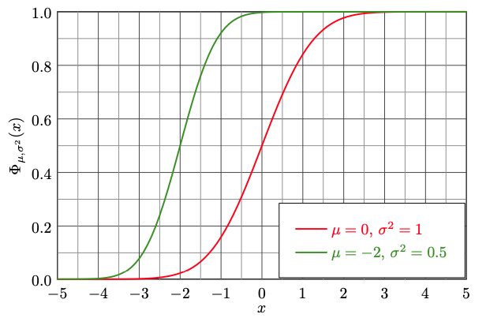
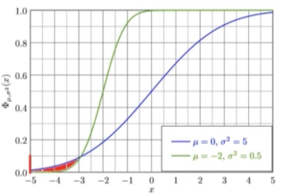

# deep-significance: Easy and Better Significance Testing for Deep Neural Networks

[]()
[](https://coveralls.io/github/Kaleidophon/deep-significance?branch=main)
[]()
[](https://www.gnu.org/licenses/gpl-3.0)
[](https://github.com/python/black)
[](https://zenodo.org/badge/latestdoi/341677886)

**Contents**

* [:interrobang: Why](#interrobang-why)
* [:inbox_tray: Installation](#inbox_tray-installation)
* [:bookmark: Examples](#bookmark-examples)
  * [Intermezzo: Almost Stochastic Order - a better significance test for Deep Neural Networks](#intermezzo-almost-stochastic-order---a-better-significance-test-for-deep-neural-networks)
  * [Scenario 1: Comparing multiple runs of two models](#scenario-1---comparing-multiple-runs-of-two-models)
  * [Scenario 2: Comparing multiple runs across datasets](#scenario-2---comparing-multiple-runs-across-datasets) 
  * [Scenario 3: Comparing sample-level scores](#scenario-3---comparing-sample-level-scores)
  * [Scenario 4: Comparing more than two models](#scenario-4---comparing-more-than-two-models)
  * [How to report results](#newspaper-how-to-report-results)
  * [Other features](#sparkles-other-features)
  * [General Recommendations & other notes](#general-recommendations) 
* [:mortar_board: Cite](#mortar_board-cite)
* [:medal_sports: Acknowledgements](#medal_sports-acknowledgements)
* [:books: Bibliography](#books-bibliography)

### :interrobang: Why?

Although Deep Learning has undergone spectacular growth in the recent decade,
a large portion of experimental evidence is not supported by statistical hypothesis tests. Instead, 
conclusions are often drawn based on single performance scores. 

This is problematic: Neural network display highly non-convex
loss surfaces (Li et al., 2018) and their performance depends on the specific hyperparameters that were found, or stochastic factors 
like Dropout masks, making comparisons between architectures more difficult. Based on comparing only (the mean of) a 
few scores, **we often cannot 
conclude that one model type or algorithm is better than another**.
This endangers the progress in the field, as seeming success due to random chance might lead practitioners astray. 

For instance, a recent study in Natural Language Processing by Narang et al. (2021) has found that many modifications proposed to 
transformers do not actually improve performance. Similar issues are known to plague other fields like e.g., 
Reinforcement Learning (Henderson et al., 2018) and Computer Vision (Borji, 2017) as well. 

To help mitigate this problem, this package supplies fully-tested re-implementations of useful functions for significance
testing:
* Statistical Significance tests such as Almost Stochastic Order (Dror et al., 2019), bootstrap (Efron & Tibshirani, 1994) and 
  permutation-randomization (Noreen, 1989).
* Bonferroni correction methods for multiplicity in datasets (Bonferroni, 1936). 

All functions are fully tested and also compatible with common deep learning data structures, such as PyTorch / 
Tensorflow tensors as well as NumPy and Jax arrays.  For examples about the usage, consult the documentation 
[here](deep-significance.rtfd.io/en/latest/) or the scenarios in the section [Examples](#examples).

## :inbox_tray: Installation

The package can simply be installed using `pip` by running

    pip3 install deepsig

Another option is to clone the repository and install the package locally:

    git clone https://github.com/Kaleidophon/deep-significance.git
    cd deep-significance
    pip3 install -e .

**Warning**: Installed like this, imports will fail when the clones repository is moved.

## :bookmark: Examples

---
**tl;dr**: Use `aso()` to compare scores for two models. If the returned `eps_min < 0.5`, A is better than B. The lower
`eps_min`, the more confident the result. 

:warning: Testing models with only one set of hyperparameters and only one test set will be able to guarantee superiority
in all settings. See [General Recommendations & other notes](#general-recommendations).

---

In the following, I will lay out three scenarios that describe common use cases for ML practitioners and how to apply 
the methods implemented in this package accordingly. For an introduction into statistical hypothesis testing, please
refer to resources such as [this blog post](https://machinelearningmastery.com/statistical-hypothesis-tests/) for a general
overview or [Dror et al. (2018)](https://www.aclweb.org/anthology/P18-1128.pdf) for a NLP-specific point of view. 

In general, in statistical significance testing, we usually compare two algorithms  and  on a dataset  using 
some evaluation metric  (we assume a higher = better). The difference between the two algorithms on the 
data is then defined as 

<p align="center"></p>

where  is our test statistic. We then test the following **null hypothesis**:

<p align="center"></p>

Thus, we assume our algorithm A to be equally as good or worse than algorithm B and reject the null hypothesis if A 
is better than B (what we actually would like to see). Most statistical significance tests operate using 
*p-values*, which define the probability that under the null-hypothesis, the  expected by the test is larger than or
equal to the observed difference  (that is, for a one-sided test, i.e. we assume A to be better than B):

<p align="center"></p>

We can interpret this equation as follows: Assuming that A is *not* better than B, the test assumes a corresponding distribution
of differences that  is drawn from. How does our actually observed difference  fit in there?
This is what the p-value is expressing: If this probability is high,  is in line with what we expected under 
the null hypothesis, so we conclude A not to better than B. If the 
probability is low, that means that  is quite unlikely under the null hypothesis and that the reverse 
case is more likely - i.e. that it is 
likely *larger* than  - and we conclude that A is indeed better than B. Note that **the p-value does not 
express whether the null hypothesis is true**.

To decide when we trust A to be better than B, we set a threshold that will determine when the p-value is small enough 
for us to reject the null hypothesis, this is called the significance level  and it is often set to be 0.05.


### Intermezzo: Almost Stochastic Order - a better significance test for Deep Neural Networks

Deep neural networks are highly non-linear models, having their performance highly dependent on hyperparameters, random 
seeds and other (stochastic) factors. Therefore, comparing the means of two models across several runs might not be 
enough to decide if a model A is better than B. In fact, **even aggregating more statistics like standard deviation, minimum
or maximum might not be enough** to make a decision. For this reason, Dror et al. (2019) introduced *Almost Stochastic 
Order* (ASO), a test to compare two score distributions. 

It builds on the concept of *stochastic order*: We can compare two distributions and declare one as *stochastically dominant*
by comparing their cumulative distribution functions: 



Here, the CDF of A is given in red and in green for B. If the CDF of A is lower than B for every , we know the 
algorithm A to score higher. However, in practice these cases are rarely so clear-cut (imagine e.g. two normal 
distributions with the same mean but different variances).
For this reason, Dror et al. (2019) consider the notion of *almost stochastic dominance* by quantifying the extent to 
which stochastic order is being violated (red area):



ASO returns a value , which expresses the amount of violation of stochastic order. If 
, A is stochastically dominant over B in more cases than vice versa, then the corresponding algorithm can be declared as 
superior. We can also interpret  as a *confidence score*. The lower it is, the more sure we can be 
that A is better than B. Note: **ASO does not compute p-values.** Instead, the null hypothesis formulated as 

<p align="center"></p>

If we want to be more confident about the result of ASO, we can also set the rejection threshold to be lower than 0.5.
Furthermore, the significance level  is determined as an input argument when running ASO and actively influence 
the resulting .


### Scenario 1 - Comparing multiple runs of two models 

In the simplest scenario, we have retrieved a set of scores from a model A and a baseline B on a dataset, stemming from 
various model runs with different seeds. We want to test whether our model A is better than B (higher scores = better)- 
We can now simply apply the ASO test:

```python
import numpy as np
from deepsig import aso

# Simulate scores
N = 5  # Number of random seeds
my_model_scores = np.random.normal(loc=0.9, scale=0.8, size=N)
baseline_scores = np.random.normal(loc=0, scale=1, size=N)

min_eps = aso(my_model_scores, baseline_scores)  # min_eps = 0.0, so A is better
```

Note that ASO **does not make any assumptions about the distributions of the scores**. 
This means that we can apply it to any kind of test metric, as long as a higher score indicates a better performance 
(to apply ASO to cases where lower scores indicate better performances, just multiple your scores by -1 before feeding
them into the function). The more scores of model runs is supplied, the more reliable 
the test becomes, so try to collect scores from as many runs as possible to reject the null hypothesis confidently.

### Scenario 2 - Comparing multiple runs across datasets

When comparing models across datasets, we formulate one null hypothesis per dataset. However, we have to make sure not to 
fall prey to the [multiple comparisons problem](https://en.wikipedia.org/wiki/Multiple_comparisons_problem): In short, 
the more comparisons between A and B we are conducting, the more likely gets is to reject a null-hypothesis accidentally.
That is why we have to adjust our significance threshold  accordingly by dividing it by the number of comparisons, 
which corresponds to the Bonferroni correction (Bonferroni et al., 1936):

```python 
import numpy as np
from deepsig import aso 

# Simulate scores for three datasets
M = 3  # Number of datasets
N = 5  # Number of random seeds
my_model_scores_per_dataset = [np.random.normal(loc=0.3, scale=0.8, size=N) for _ in range(M)]
baseline_scores_per_dataset  = [np.random.normal(loc=0, scale=1, size=N) for _ in range(M)]

# epsilon_min values with Bonferroni correction 
eps_min = [aso(a, b, confidence_level=0.05 / M) for a, b in zip(my_model_scores_per_dataset, baseline_scores_per_dataset)]
# eps_min = [0.1565800030782686, 1, 0.0]
```

### Scenario 3 - Comparing sample-level scores

In previous examples, we have assumed that we compare two algorithms A and B based on their performance per run, i.e. 
we run each algorithm once per random seed and obtain exactly one score on our test set. In some cases however, 
we would like to compare two algorithms based on scores **for every point in the test set**. If we only use one seed
per model, then this case is equivalent to scenario 1. But what if we also want to use multiple seeds per model?

In this scenario, we can do pair-wise comparisons of the score distributions between A and B and use the Bonferroni 
correction accordingly:

```python 
from itertools import product 

import numpy as np
from deepsig import aso 

# Simulate scores for three datasets
M = 40   # Number of data points
N = 3  # Number of random seeds
my_model_scored_samples_per_run = [np.random.normal(loc=0.3, scale=0.8, size=M) for _ in range(N)]
baseline_scored_samples_per_run = [np.random.normal(loc=0, scale=1, size=M) for _ in range(N)]
pairs = list(product(my_model_scored_samples_per_run, baseline_scored_samples_per_run))

# epsilon_min values with Bonferroni correction 
eps_min = [aso(a, b, confidence_level=0.05 / len(pairs)) for a, b in pairs]
```

### Scenario 4 - Comparing more than two models 

Similarly, when comparing multiple models (now again on a per-seed basis), we can use a similar approach like in the 
previous example. For instance, for three models, we can create a  matrix and fill the entries 
with the corresponding  values. The diagonal will naturally always be 1, but we can also restrict 
ourselves to only filling out one half of the matrix by making use of the following symmetry property of ASO:

<p align="center"></p>

---
**Note**: While an appealing shortcut, it has been observed during testing this property, due to the random element
of bootstrap iterations, might not always hold exactly - the difference between the two quantities has been seen to 
amount to up to * when the scores distributions of A and B are very similar.

*This is just an empirically observed value, not a tight bound.

---

The package implements the function `multi_aso()` exactly for this purpose. It has the same arguments as `aso()`, with 
a few differences. First of all, the function takes a single `scores` argument, which can be a list of lists (of scores),
or a nested NumPy array or Tensorflow / PyTorch / Jax tensor or dictionary (more about that later). 
Let's look at an example:

```python 
import numpy as np 
from deepsig import multi_aso 
 
N = 5  # Number of random seeds
M = 3  # Number of different models / algorithms

# Simulate different model scores by sampling from normal distributions with increasing means
# Here, we will sample from N(0.1, 0.8), N(0.15, 0.8), N(0.2, 0.8)
my_models_scores = [np.random.normal(loc=loc, scale=0.8, size=N) for loc in np.arange(0.1, 0.1 + 0.05 * M, step=0.05)]

eps_min = multi_aso(my_model_scores, confidence_level=0.05)
    
# eps_min =
# array([[1., 1., 1.],
#        [0., 1., 1.],
#        [0., 0., 1.]])
```

In the example, `eps_min` is now a matrix, containing the  score between all pairs of models (for 
the same model, it set to 1 by default). The function applies the bonferroni correction for multiple comparisons by 
default, but this can be turned off by using `use_bonferroni=False`. In order to save compute, the above symmetry
property is used as well, but this can also be disabled by `use_symmetry=False`.

Lastly, when the `scores` argument is a dictionary and the function is called with `return_df=True`, the resulting matrix is 
given as a `pandas.DataFrame` for increased readability:

```python 
import numpy as np 
from deepsig import multi_aso 
 
N = 5  # Number of random seeds
M = 3  # Number of different models / algorithms

# Same setup as above, but use a dict for scores
my_models_scores = {
  f"model {i+1}": np.random.normal(loc=loc, scale=0.8, size=N) 
  for i, loc in enumerate(np.arange(0.1, 0.1 + 0.05 * M, step=0.05))
}

# my_model_scores = {
#   "model 1": array([...]),
#   "model 2": array([...]),
#   ...
# }

eps_min = multi_aso(my_model_scores, confidence_level=0.05, return_df=True)
    
# This is now a DataFrame!
# eps_min =
#           model 1   model 2  model 3
# model 1       1.0       1.0      1.0
# model 2       0.0       1.0      1.0
# model 3       1.0       0.0      1.0

```

### :newspaper: How to report results

When ASO used, two important details have to be reported, namely the confidence level  and the 
score. Below lists some example snippets reporting the results of scenarios 1 and 4:

    Using ASO with a confidence level $\alpha = 0.05$, we found the score distribution of algorithm A based on three 
    random seeds to be stochastically dominant over B ($\epsilon_\text{min} = 0$).

    We compared all pairs of models based on five random seeds each using ASO with a confidence level of 
    $\alpha = 0.05$ (before adjusting for all pair-wise comparisons using the Bonferroni correction). Almost stochastic 
    dominance ($\epsilon_\text{min} < 0.5)$ is indicated in table X.

### :sparkles: Other features

#### :rocket: For the impatient: ASO with multi-threading

Waiting for all the bootstrap iterations to finish can feel tedious, especially when doing many comparisons. Therefore, 
ASO supports multithreading using `joblib`
via the `num_jobs` argument. 

```python
from deepsig import aso
import numpy as np
from timeit import timeit

a = np.random.normal(size=5)
b = np.random.normal(size=5)

print(timeit(lambda: aso(a, b, num_jobs=1, show_progress=False), number=5))  # 146.6909574989986
print(timeit(lambda: aso(a, b, num_jobs=4, show_progress=False), number=5))  # 50.416724971000804
```

#### :electric_plug: Compatibility with PyTorch, Tensorflow, Jax & Numpy

All tests implemented in this package also can take PyTorch / Tensorflow tensors and Jax or NumPy arrays as arguments:

```python
from deepsig import aso 
import torch

a = torch.randn(5, 1)
b = torch.randn(5, 1)

aso(a, b)  # It just works!
```

#### |:woman_farmer:| Setting seeds for replicability

In order to ensure replicability, both `aso()` and `multi_aso()` supply as `seed` argument. This even works 
when multiple jobs are used!

#### :game_die: Permutation and bootstrap test 

Should you be suspicious of ASO and want to revert to the good old faithful tests, this package also implements 
the paired-bootstrap as well as the permutation randomization test. Note that as discussed in the next section, these 
tests have less statistical power than ASO. Furthermore, a function for the Bonferroni-correction using 
p-values can also be found using `from deepsig import bonferroni_correction`.

```python3
import numpy as np
from deepsig import bootstrap_test, permutation_test

a = np.random.normal(loc=0.8, size=10)
b = np.random.normal(size=10)

print(permutation_test(a, b))  # 0.16183816183816183
print(bootstrap_test(a, b))    # 0.103
```


### General recommendations & other notes

* Naturally, the CDFs built from `scores_a` and `scores_b` can only be approximations of the true distributions. Therefore,
as many scores as possible should be collected, especially if the variance between runs is high. If only one run is available,
  comparing sample-wise score distributions like in scenario 3 can be an option, but comparing multiple runs will 
  **always** be preferable. Ideally, scores should be obtained even using different sets of hyperparameters per model.
  Because this is usually infeasible in practice, Bouthilier et al. (2020) recommend to **vary all other sources of variation**
  between runs to obtain the most trustworthy estimate of the "true" performance, such as data shuffling, weight initialization etc.

* `num_samples` and `num_bootstrap_iterations` can be reduced to increase the speed of `aso()`. However, this is not 
recommended as the result of the test will also become less accurate. Technically,  is a upper bound
  that becomes tighter with the number of samples and bootstrap iterations (del Barrio et al., 2017). Thus, increasing 
  the number of jobs with `num_jobs` instead is always preferred.
  
* Bootstrap and permutation-randomization are all non-parametric tests, i.e. they don't make any assumptions about 
the distribution of our test metric. Nevertheless, they differ in their *statistical power*, which is defined as the probability
  that the null hypothesis is being rejected given that there is a difference between A and B. In other words, the more powerful 
  a test, the less conservative it is and the more it is able to pick up on smaller difference between A and B. Therefore, 
  if the distribution is known or found out why normality tests (like e.g. Anderson-Darling or Shapiro-Wilk), something like 
  a parametric test like Student's or Welch's t-test is preferable to bootstrap or permutation-randomization. However, 
  because these test are in turn less applicable in a Deep Learning setting due to the reasons elaborated on in 
  [Why?](#interrobang-why), ASO is still a better choice.

### :mortar_board: Cite

If you use the ASO test via `aso()`, please cite the original work:

    @inproceedings{dror2019deep,
      author    = {Rotem Dror and
                   Segev Shlomov and
                   Roi Reichart},
      editor    = {Anna Korhonen and
                   David R. Traum and
                   Llu{\'{\i}}s M{\`{a}}rquez},
      title     = {Deep Dominance - How to Properly Compare Deep Neural Models},
      booktitle = {Proceedings of the 57th Conference of the Association for Computational
                   Linguistics, {ACL} 2019, Florence, Italy, July 28- August 2, 2019,
                   Volume 1: Long Papers},
      pages     = {2773--2785},
      publisher = {Association for Computational Linguistics},
      year      = {2019},
      url       = {https://doi.org/10.18653/v1/p19-1266},
      doi       = {10.18653/v1/p19-1266},
      timestamp = {Tue, 28 Jan 2020 10:27:52 +0100},
    }

Using this package in general, please cite the following:

    @software{dennis_ulmer_2021_4638709,
      author       = {Dennis Ulmer},
      title        = {{deep-significance: Easy and Better Significance 
                       Testing for Deep Neural Networks}},
      month        = mar,
      year         = 2021,
      note         = {https://github.com/Kaleidophon/deep-significance},
      publisher    = {Zenodo},
      version      = {v1.0.0a},
      doi          = {10.5281/zenodo.4638709},
      url          = {https://doi.org/10.5281/zenodo.4638709}
    }

### :medal_sports: Acknowledgements

This package was created out of discussions of the [NLPnorth group](https://nlpnorth.github.io/) at the IT University 
Copenhagen, whose members I want to thank for their feedback. The code in this repository is in multiple places based on
several of [Rotem Dror's](https://rtmdrr.github.io/) repositories, namely 
[this](https://github.com/rtmdrr/replicability-analysis-NLP), [this](https://github.com/rtmdrr/testSignificanceNLP)
and [this one](https://github.com/rtmdrr/DeepComparison). Thanks also go out to her personally for being available to 
answer questions and provide feedback to the implementation and documentation of this package.

The commit message template used in this project can be found [here](https://github.com/Kaleidophon/commit-template-for-humans).
The inline latex equations were rendered using [readme2latex](https://github.com/leegao/readme2tex).

### :books: Bibliography

Del Barrio, Eustasio, Juan A. Cuesta-Albertos, and Carlos Matrán. "An optimal transportation approach for assessing almost stochastic order." The Mathematics of the Uncertain. Springer, Cham, 2018. 33-44.

Bonferroni, Carlo. "Teoria statistica delle classi e calcolo delle probabilita." Pubblicazioni del R Istituto Superiore di Scienze Economiche e Commericiali di Firenze 8 (1936): 3-62.

Borji, Ali. "Negative results in computer vision: A perspective." Image and Vision Computing 69 (2018): 1-8.

Bouthillier, Xavier, et al. "Accounting for variance in machine learning benchmarks." Proceedings of Machine Learning and Systems 3 (2021).

Dror, Rotem, et al. "The hitchhiker’s guide to testing statistical significance in natural language processing." Proceedings of the 56th Annual Meeting of the Association for Computational Linguistics (Volume 1: Long Papers). 2018.

Dror, Rotem, Shlomov, Segev, and Reichart, Roi. "Deep dominance-how to properly compare deep neural models." Proceedings of the 57th Annual Meeting of the Association for Computational Linguistics. 2019.

Efron, Bradley, and Robert J. Tibshirani. "An introduction to the bootstrap." CRC press, 1994.

Henderson, Peter, et al. "Deep reinforcement learning that matters." Proceedings of the AAAI Conference on Artificial Intelligence. Vol. 32. No. 1. 2018.

Hao Li, Zheng Xu, Gavin Taylor, Christoph Studer, Tom Goldstein. "Visualizing the Loss Landscape of Neural Nets." NeurIPS 2018: 6391-6401

Narang, Sharan, et al. "Do Transformer Modifications Transfer Across Implementations and Applications?." arXiv preprint arXiv:2102.11972 (2021).

Noreen, Eric W. "Computer intensive methods for hypothesis testing: An introduction." Wiley, New York (1989).
